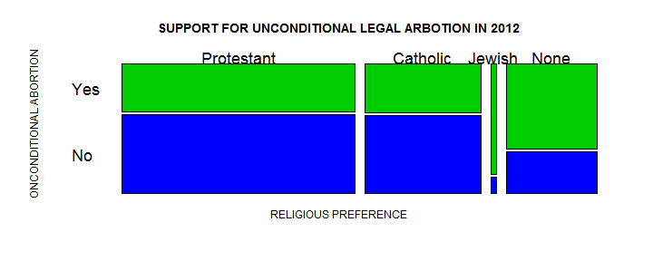
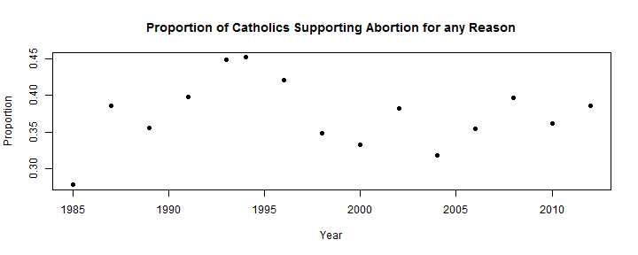
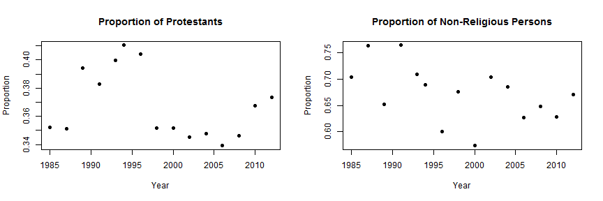

<!-- Make sure that the knitr package is installed and loaded. -->
<!-- For more info on the package options see http://yihui.name/knitr/options -->

<!-- Replace below with the title of your project -->
### THE RELATIONSHIP BETWEEN RELIGIOUS PREFERENCE AND SUPPORT FOR  UNCONDITIONAL  LEGAL ABORTION AMOUNGST ENGLISH AND SPANISH SPEAKING ADULT POPULATION IN THE UNITED STATES OF AMERICA

<!-- Enter the code required to load your data in the space below. The data will be loaded but the line of code won't show up in your write up (echo=FALSE) in order to save space-->


<!-- In the remainder of the document, add R code chunks as needed -->

### Introduction:

Abortion and its legalization remains a highly controversial issue in the whole world. Religious traditions, such as Christianity, Islam, Buddhism and Hinduism, have taken a strong stand on all forms of abortion. Within Christianity, contemporary Christian denominations have different positions, thoughts and teachings about abortion, especially in extenuating circumstances. According to Kaczor(2011), the Catholic Church, the Eastern Orthodox,  Church Oriental Orthodoxy, and most evangelical Protestants oppose deliberate abortion as immoral, while allowing what is sometimes called indirect abortion, namely, an action that does not seek the death of the fetus as an end or a means but that is followed by the death as a side effect. More generally, some Christian denominations can be considered pro-life while others may be considered pro-choice, however in most religious traditions there is disagreement with the denomination's stance on abortion. 

The purpose (research question) of this research paper is to establish the relationship between religious affiliation and the support for  unconditional (for any reason) legal abortion amongst English and Spanish speaking adult (18 years and older) population in the United States of America (USA). Answering this question will help us better understand how religious affiliation influence thoughts on  unconditional legal abortion. 

 

### Data:

The data used in this study was extracted from the General Social Survey (GSS) File 1972-2012, and it can be loaded into R using the **load** command as follows : **load(url("http://bit.ly/dasi_gss_data")**. The original GSS data can be obtained from the GSS Persistent URL: http://doi.org/10.3886/ICPSR34802.v1. In this study, we use will statistical methods to analyze the proportion of support for unconditional(for any reason) legal abortion amongst the different religious preferences (Catholic, Protestant, None Religious, Jewish, Other Religions) of the respondents in the GSS survey. Furthermore a comparison of the different groups will be made. 

According to the GSS project description website:http://www.norc.org/Research/Projects/Pages/general-social-survey.aspx (accessed: 30 March, 2014) ),  *"Since 1972, the General Social Survey (GSS) has been monitoring societal change and studying the growing complexity of American society. The GSS aims to gather data on contemporary American society in order to monitor and explain trends and constants in attitudes, behaviors, and attributes; to examine the structure and functioning of society in general as well as the role played by relevant subgroups"*. 

Initially data was collected from English speaking 18 years old USA residents. However starting in 2006, Spanish speakers were added to the target population. The data was was collected using face-to-face and telephone interviews. Between the years 1972 and 2000, the survey was conducted in a paper-and-pencil format, but starting in 2002 computer-assisted personal interviewing (CAPI) was used.


Amongst other questions in the GSS survey the respondents were asked the following question regarding religious preference: **What is your religious preference? Is it Protestant, Catholic, Jewish, some other religion or no religion?**. The expected responses to the question were one of the following: PROTESTANT, CATHOLIC, JEWISH, NONE, OTHER, BUDDHISM, HINDUISM, OTHER EASTERN, MOSLEM/ISLAM, ORTHODOX-CHRISTIAN, CHRISTIAN, NATIVE AMERICAN, INTER-DENOMINATIONAL. 

The respondents were also asked to express their thoughts on unconditional (for any reason) legal abortion. The question asked was : **Please tell me whether or not you think it should be possible for a pregrant woman to obtain legal abortion; if the woman wants it for any reason?** The expected expected responses to the question were either YES OR NO. In this research report we are going to use statistical methods to analyse the responses to only these two question in order to establish the relationship between religious preference and support for unconditional (for any reason) abortion.

The extracted GSS data set file we are using for this study contains 57061 observations/cases. Each observation/case captures individual persons responses to 114 variables that arise from the questions that were asked. For the purposes of this research paper only the two (2) variables related to the questions on religious preference (called **relig** in the GSS survey) and support for abortion for any reason ( (called **abany** in the GSS survey)  will be considered and analysed. Both variables of interest are categorical variables. In this research report the religious preference variable will be used as an explanatory variable, and the support for legal abortion for any reason variable will be used as a response variable. 

The GSS data was collected using interviews and it is not an experiment but an observational study. Therefore, the data can not be used to establish causal links between religious preference and support for unconditional legal abortion. However, in this study we will use the data to establish correlation. Since the target population is only English and Spanish speaking adults in the USA, and full random probability sampling was used in the survey (Smith, Tom W. et al,2013), the results of our analysis can only be generalized to all English and Spanish speaking adults in the USA. 

The data available consists mainly Catholic, Protestant and None religious respondents, and very few responses from the religious preferences such as Jewish, Buddhism and others. Therefore, with the data available it would only be possible to generalize our findings to Catholic, Protestant and non-religious,  English and Spanish speaking adults (18 years or older) residents in the USA. The small number of respondents from other religious tradition such as Islam and Buddhism may be an indication of non-response bias. The restriction to English and Spanish speakers may have also biased the survey towards Christian traditions as opposed to other traditions such as Islam and Buddhism.


### Exploratory data analysis:

After extracting the variables of interest (**relig** and **abany**) from the GSS data file, and grouping by year without null values we are left with dataset a containing 31714 observations and 3 variables (**year**, **relig** and **abany**).**APPENDIX A** ahead provides provides a listing of a few observations in the resulting data set. Based on the GSS 2012 data alone, the contingency table is as shown below:


```
##                          
##                            Yes   No  Sum
##   Protestant               219  367  586
##   Catholic                 113  180  293
##   Jewish                    13    2   15
##   None                     153   75  228
##   Other                     15    5   20
##   Buddhism                   2    1    3
##   Hinduism                   4    3    7
##   Other Eastern              3    1    4
##   Moslem/Islam               2    9   11
##   Orthodox-Christian         1    1    2
##   Christian                 28   45   73
##   Native American            0    2    2
##   Inter-Nondenominational    1    1    2
##   Sum                      554  692 1246
```


The contingency table above (and contingency tables for other years), clearly show that over the 40 year period that the GSS survey has been conducted, the respondents have predominantly been Protestants, Catholics and non-religious. A further exploration of the data from 1972 to 2012, also shows that in most of the yearly surveys, the response from the smaller religious preferences did not satisfy the minimum condition of at least 10 successes (YES to abortion for any reason) and at least 10 failures (No to abortion for any reason). This is clearly the case for the GSS 2012 results as reflected in the contingency table above.

Based on the GSS 2012 data, the relative proportions of the data amongst the different religious preferences, and the difference between the larger and smaller groupings can also be observed in the mosaic plot shown below.Only the first four (4) preferences are shown.
 

We can observe from the plot, and contingency table, that in the GSS 2012 survey, the support for unconditional legal abortion is higher amongst the non-religious respondents. A majority 67% of the non-religious respondents supported unconditioned legal abortion and they constituted 12.3% of the people surveyed in that year. The response from the Protestants and Catholics appears to be similar, with the majority in both groups indicating that they do not support unconditional legal abortion. Only 38.6% and 37.4%  of the Catholic and Protestant respondents, respectively,  supported abortion for any reason in the GSS 2012 survey, and they constituted 9.1% and 17.6% , respectively, of the people surveyed in that year. 


### Inference:

In this section we will discuss hypothesis tests and confidence intervals based on the religious groupings that have sufficient data and satisfy the success-failure condition. These are the Protestant, Catholic and the non-religious groups. 

We are told (GSS Cumulative Codebook, 1972-2012) that Full random probability sampling was used, and we are choosing religious preferences (Catholic, Protestant, None) that meet the condition of at least ten (10) successes and ten(10) failures, we can use statistical inference to compute the proportion of the Catholics, Protestants and non-religious people who support abortion for any reason.

Using the inference function (source("http://bit.ly/dasi-inference")), and the GSS data for each year, we can compute the proportion of support for each of the religious preferences. Tabulated below are the results of using this function for GSS surveys for the years 2006, 2008, 2012 and 2012. A more details list, and an illustration of how the inference function was used, can found in **APPENDIX B**.
![][id1]
[id1]: infsummary1.png 
Similar population proportions were also calculated using the inference function for the years 1985 up to 2012. Complete details of these calculations can be found in the Appendix. The following plot shows the trends amongst Catholic populations based on GSS surveys conducted at two(2) intervals from 1985 to 1993, and then two(2) years intervals from 1994 to 2012. 
 

The plot shows that the majority of adult English and Spanish speaking Catholics in the USA  do not generally support unconditional legal abortion for any reason. The  highest support (45% of the population)  was in 1994 and thereafter remained relatively consistent between 32% and 40% of the population.

Similar plots for the Protestant and Non-religious preferences are shown below.
 

The protestant plot of proportions shows that the majority of English and Spanish speaking adult Protestants in the USA  do not generally support abortion for any reason. The  highest support (41% of the population)  was in 1994. The proportion then to dropped to 35% in 1998, and thereafter remained relatively consistent between 34% and 37% of the population. Similarly, the Non-religious preference plot shows that the main supporters of abortion for any reason are the non-religious amongst the English and Spanish speaking adult in the USA. The  highest support (76%)  was in 1991 and and thereafter remained relatively consistent between 33% and 70% of the population.

In all three(3) religious preferences considered above, the year 1994 appears to be a significant reference point where support for unconditional legal abortion amongst the Catholic, Protestants and Non-religious respondents was relatively high. We will now construct 95% confidence intervals and hypothesis tests in order to determine if there is any significant difference between the 2012 and 1994 proportions. 

The null hypothesis (H0) in each case (Catholic, Protestant, and None case) is that there is no difference in the proportion of the population that supported legal abortion for any reason between the surveys conducted in 2012 and 1994. The alternative hypothesis (HA) is that there is a difference, and that proportions (for each group) observed in 2012 are different from what was observed in 1994. 

In both the 2012 and 1994 survey the conditions of the central limit theory (CLT) were satisfied since we are told that full random probability was used, and from the data we observed that the success-failure condition of at least ten(10) successes and failures was also met. Therefore the difference between sample the proportions follows a normal distribution centered around the true population difference. 

Using the inference function (source("http://bit.ly/dasi-inference")), and the GSS data for 1994 and 2012, we computed the 95% confidence intervals and the p-values based on the difference in proportions. The results are as tabulated below: 
![][id1a]
[id1a]: diff.png 
Based on the calculations shown above, we are 95% confident that in 2012 the proportion of English and Spanish speaking adult Catholics in the USA that supported legal abortion for any reason was between 13.7% lower and 0.5% higher than it was in 1994. And because the p-value (6.9%) is higher than the significant level of 5%, we fail to reject the null hypothesis and conclude that we have found convincing evidence that support for abortion for any reason amongst the Catholic population has not significantly changed since 1994.

Similarly, we are 95% confident that in 2012 the proportion of English and Spanish speaking adult Protestants in the USA that supported unconditional legal abortion was between 8.5% lower and 1.2 % higher than it was in 1994. And because the p-value (13.7%) is higher than the significant level of 5%, we fail to reject the null hypothesis and conclude that we have found significant evidence that support for abortion for any reason amongst the protestant population has not significantly changed since 1994.

We are also 95% confident that in 2012 the proportion of English and Spanish speaking non-religious adults in the USA that supported legal abortion for any reason was between 10.9% lower and 7.3 % higher than it was in 1994. And because the p-value (7.0%) is higher than the significant level of 5%, we fail to reject the null hypothesis and conclude that we have found convincing evidence that support for abortion for any reason amongst the non-religious population has not significantly changed since 1994.

Finally we will now construct a hypotheses test to help us answer our main research question. That is, IS THERE A RELATIONSHIP BETWEEN RELIGIOUS PREFERENCE AND SUPPORT FOR UNCONDITIONAL (FOR ANY REASON) LEGAL ABORTION AMOUNGST ENGLISH AND SPANISH SPEAKING ADULT POPULATION IN THE UNITED STATES OF AMERICA? 

For this purpose we will use the GSS 2012 survey data. Since both the explanatory and response variable are categorical variables, and the explanatory variable has more than 2 levels (religious preferences) and the response variable has 2 levels (YES/NO) a **Chi-Square test of independence** shall be used to test the following hypotheses.

**The null hyphothese (HO)**: *Support for legal abortion for any reason (if the pregnant women wants) and religious preference are independent. That is support for unconditional legal abortion does not vary from one religious preference to another.*

**The alternative hyphothese (HA)**: *Support for legal arbotion for any reason (if the pregnant women wants) and religious preference are dependent. That is,  support for unconditional legal abortion does vary from one religious preference to another.*

Before we computer the Chi-Square test of independence statistic, we need to check if all the conditions are satisfied. Firstly we consider the independence condition. This is satisfied since  we are told (GSS Cumulative Codebook, 1972-2012) that Full random probability sampling was used, so we can reasonable assume that sample observations are independent, and from the data we observe that the sample size is less than 10% of the population. The second condition is that each cell must have at least five(5) expected counts. This condition is not met for the smaller religious preferences such as **Buddism, Hinduism, Other Eastern, Moslem/Islam, Orthodox-Christian, Native American** and **Inter-Nondenominational**. Therefore, for the purposes of this analysis, the Chi-Square of independence tests statistic was calculated based on the religious preference where both conditions were met. 


Using the Chi-Square test of Independence formula, and GSS 2012 data, we obtained the results tabulated below:
![][id3]
[id3]: mychisquare2.png 
We observe that the p-value obtained is significantly very small, and therefore we reject the null hypothesis in favor of the alternative hypotheses, and conclude that **we have found convincing evidence that support for unconditional legal arbotion  (if the pregnant women wants; for any reason) and religious preference are dependent**. The Chi-Square test of indepennce was also calculated for the 2006, 2008  and 2010 GSS surveys, and they all occur with this conclusion.

### Conclusion:

We we have found convincing evidence that support for unconditional legal abortion(if the pregnant women wants and for any reason) and religious preference are dependent. We have also found within English and Spanish speaking adult population, the proportion of the population that support unconditional abortion is predominantly high amongst the non-religious persons and has remained so since 1994. The majority of the Catholic and Protestant population do not support unconditional abortion and this appears to be in line with the policies of their respective denominations. In other words, church policy appears to be a confounding factor. 

Since the DSS survey was only limited to English and Spanish speakers, the results of this analysis can only be generalized to English and Spanish speaking population in USA. This is particularly so, because the language restriction appears to have limited the response from other religious traditions whose following is predominantly not English or Spanish speakers.

Future research could look at the confounding factors such as church poliy and political affiliation.


### References

*General Social Survey, 1972-2012:  Cumulative  Codebook*. http://www3.norc.org/GSS+Website/Documentation/ (accessed 1 April, 2014)

Kaczor, C. (2011). *The ethics of abortion : women’s rights, human life and the question of justice*. Routledge.

Smith, Tom W., Michael Hout, and Peter V. Marsden.(2013) *General Social Survey, 1972-2012 [Cumulative File]*. ICPSR34802-v1. Storrs, CT: Roper Center for Public Opinion Research, University of Connecticut /Ann Arbor, MI: Inter-university Consortium for Political and Social Research [distributors], 2013-09-11. doi:10.3886/ICPSR34802.v1
Persistent URL: http://doi.org/10.3886/ICPSR34802.v1

### APPENDIX  A : MY PROJECT DATA 


```r
head(myproj_data, n = 30)
```

```
##      year      relig abany
## 7591 1977   Catholic   Yes
## 7592 1977   Catholic   Yes
## 7593 1977   Catholic    No
## 7594 1977       None   Yes
## 7595 1977   Catholic    No
## 7596 1977 Protestant   Yes
## 7597 1977   Catholic   Yes
## 7598 1977   Catholic    No
## 7599 1977   Catholic    No
## 7600 1977 Protestant   Yes
## 7601 1977   Catholic    No
## 7602 1977 Protestant   Yes
## 7603 1977 Protestant   Yes
## 7604 1977   Catholic    No
## 7606 1977   Catholic    No
## 7607 1977 Protestant   Yes
## 7608 1977       None   Yes
## 7609 1977       None   Yes
## 7610 1977 Protestant    No
## 7611 1977   Catholic    No
## 7612 1977   Catholic    No
## 7613 1977   Catholic    No
## 7614 1977   Catholic    No
## 7615 1977       None   Yes
## 7616 1977   Catholic   Yes
## 7617 1977      Other    No
## 7618 1977 Protestant   Yes
## 7619 1977   Catholic    No
## 7620 1977   Catholic    No
## 7621 1977   Catholic   Yes
```


### APPENDIX B : CALCULATION OF PROPORTIONS (phat) DATA FROM 1985 - 2012

The inference function (source("http://bit.ly/dasi-inference")) was used to generate inference data each  of the three(3)religious preferences (Catholic, Protestant, None) under considerations, grouped by year of survey. In order to simply the tasks a few functions were defined and used as shown below. 

**createYearlyGroupedData (Targetrelig, Targetyear)**
This function extracts and creates a subject of the main project data for a given religious preference matching a particular given year.  The following R commands shows the definition of the function, and how its used to create the Catholic group data for 2012. The first six(6) observations are shown.


```r
createYearlyGroupedData = function(Targetrelig, Targetyear) {
    subset(myproj_data, myproj_data$relig == Targetrelig & myproj_data$year == 
        Targetyear)
}

cathdata2012 <- createYearlyGroupedData("Catholic", 2012)
head(cathdata2012)
```

```
##       year    relig abany
## 55088 2012 Catholic   Yes
## 55089 2012 Catholic   Yes
## 55095 2012 Catholic    No
## 55098 2012 Catholic    No
## 55106 2012 Catholic    No
## 55107 2012 Catholic    No
```


**getInferenceData_NoPlot**


This function uses the inference function to compute inference statistics for a particular religious preference for a particular year.The following R commands shows the definition of the function, and how its used to compute the the inference data for the Catholic preferences based on GSS 2012 data. 

** Note : Inference function failing to load in knit R so Commands below are commented out., **

```r
# source('http://bit.ly/dasi_inference')

# getInferenceData_NoPlot = function (TargetGroupYearData) {
# inference(TargetGroupYearData$abany, est='proportion', type

# ='ci', method='theoretical', success='Yes', eda_plot=FALSE) }

# getInferenceData_NoPlot(createYearlyGroupedData('Catholic', 2012))
```


**getGroupInferenceData_NoPlot**

This function uses the **getInferenceData_NoPlot** function in a **for loop** to compute all inference data for a particular religious preference, between a start and end year, and at specific intervals. The following R commands define the function, shows show it can be used to generate Catholic preference proportions from 1994 to 2012, at two year intervals.

**NOte : Again, commands commented because of knit R and inference function issues **

```r
# getGroupInferenceData_NoPlot = function (targetGroup, startYear, endYear,
# stepby) { for (year in seq(startYear, endYear,stepby)) { cat('\n\n\n')
# print (paste (year, 'Inference Data for', targetGroup, 'Group') )
# getInferenceData_NoPlot(createYearlyGroupedData (targetGroup, year)) } }

# getGroupInferenceData_NoPlot('Catholic', 1994, 2012, 2)
```


Using these functions, proportions for all the  years 1985 to 1993 and 1994 to 2012 at 2 year intervals, were computed, compiled and stored in a new dataset (myinference_data.Rda). The first few observations in this dataset are shown below. [all variables are shown except sample size in order to fit into page. [In any case **samplesise = success+failure**]


```r
choicevars <- c("year", "relig", "success", "failure", "se", "phat")
head(myinference_data[choicevars], n = 6)
```

```
##   year    relig success failure     se   phat
## 1 1994 Catholic     220     267 0.0226 0.4517
## 2 1996 Catholic     181     249 0.0238 0.4209
## 3 1998 Catholic     151     283 0.0290 0.3479
## 4 2000 Catholic     142     284 0.0228 0.3333
## 5 2002 Catholic      86     139 0.0324 0.3822
## 6 2004 Catholic      65     139 0.0326 0.3186
```


